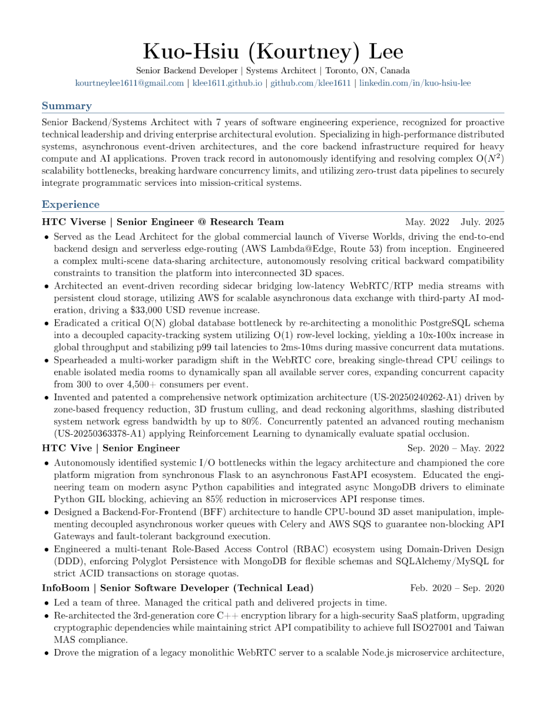

# Resume LaTeX Template

This repository contains a simple, reusable LaTeX resume template organized into separate section files.

## Preview

[Download the generated PDF](./resume.pdf)



## Structure

- `main.tex` is the root document.
- `resume.sty` contains the shared layout, spacing, and helper commands.
- `sections/header.tex` contains your name, contact details, links, and location.
- `sections/summary.tex` contains your professional summary.
- `sections/experience.tex` contains your work experience entries.
- `sections/honors_projects_certifications.tex` contains honors, projects, and certifications.
- `sections/patents.tex` contains patents or filings.
- `sections/publications_research.tex` contains publications and academic research.
- `sections/education.tex` contains education details.
- `Makefile` builds the final PDF.

## Requirements

You need `make` and a LaTeX engine. The default build uses `pdflatex`.

## Build

Run:

```sh
make
```

This generates `resume.pdf`.

If you want to use a different engine, override `LATEX`:

```sh
make LATEX=xelatex
```

If `pdflatex` is not installed, the `Makefile` will print a clear error message instead of failing silently.

The `Makefile` also supports `tectonic`:

```sh
make LATEX=tectonic
```

## Clean generated files

Run:

```sh
make clean
```

## Customization

Update `sections/header.tex` with your personal details.

Replace the placeholder content in each section file with your own resume content.

If you want to adjust spacing, colors, or helper commands, edit `resume.sty`.
