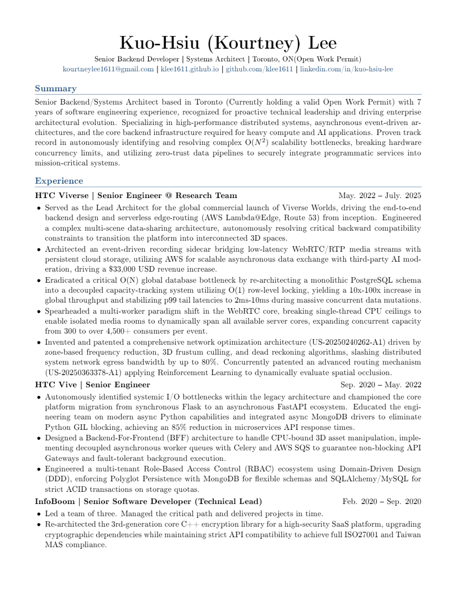
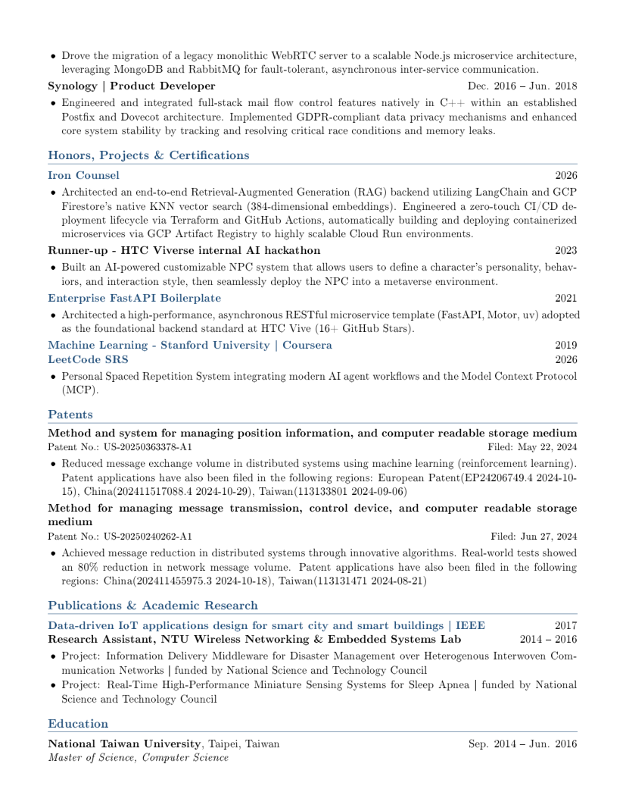
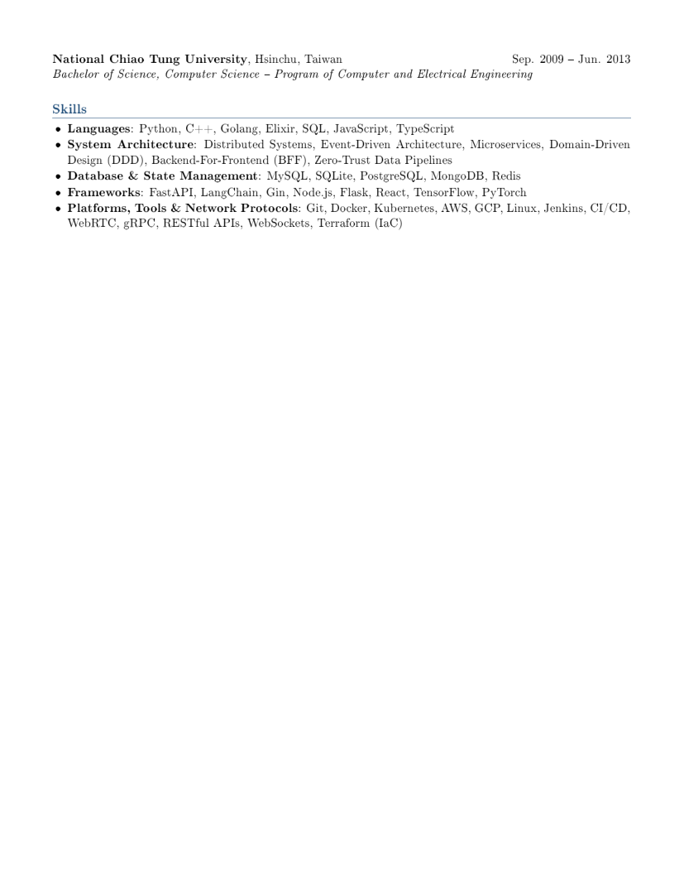
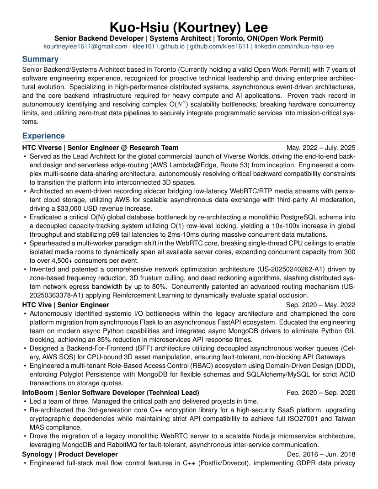
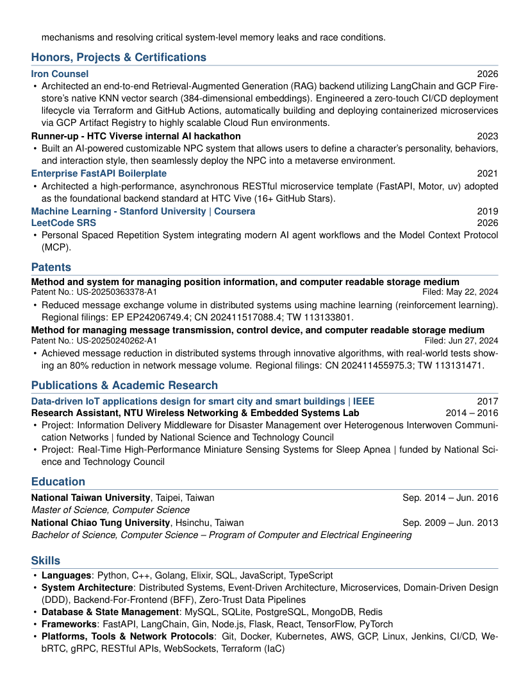

# CV and Resume LaTeX Template

This repository contains two related LaTeX document variants:

- `cv/` for the fuller, multi-page curriculum vitae
- `resume/` for the denser, whitespace-optimized resume

Both are built from a single root `Makefile`.

## Preview

[Download the CV PDF](./cv.pdf)

[Download the Resume PDF](./resume.pdf)

## CV Preview

### Page 1



### Page 2



### Page 3



## Resume Preview

### Page 1



### Page 2



## Structure

- `cv/` contains the current full CV document and its section files.
- `resume/` contains the denser resume variant and its section files.
- Each directory has its own `main.tex`, `resume.sty`, and `sections/` tree.
- The root `Makefile` builds both final PDFs.

## Requirements

You need `make` and a LaTeX engine. The default build uses `pdflatex`.

## Build

Build both documents:

```sh
make
```

This generates `cv.pdf` and `resume.pdf`.

Generate the README preview assets after building:

```sh
make assets
```

This regenerates the PNG previews in `assets/` from `cv.pdf` and `resume.pdf`. Requires `uv` — PyMuPDF is fetched automatically via `uv run`, no manual dependency installation needed.

Build only the CV:

```sh
make cv
```

Build only the resume:

```sh
make resume
```

If you want to use a different engine, override `LATEX`:

```sh
make LATEX=xelatex
```

If `pdflatex` is not installed, the `Makefile` will print a clear error message instead of failing silently.

The `Makefile` also supports `tectonic`:

```sh
make LATEX=tectonic
```

## Clean generated files

Run:

```sh
make clean
```

## Customization

Update `cv/sections/header.tex` and `resume/sections/header.tex` with your personal details.

Replace the content in the `cv/sections/` and `resume/sections/` files with your own material.

If you want to adjust formatting, edit `cv/resume.sty` for the CV or `resume/resume.sty` for the denser resume.
